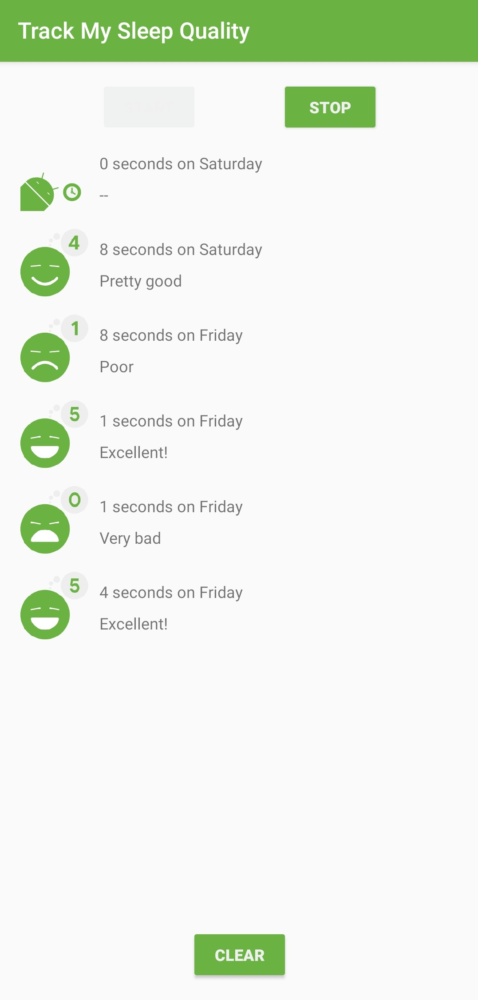
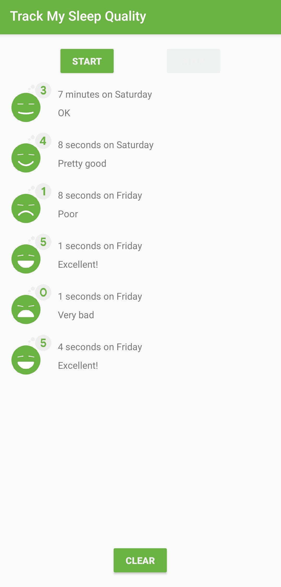

# Room - SleepQualityTracker app

This is the toy app for Lesson 6 of the [Android App Development in Kotlin course on Udacity](https://www.udacity.com/course/???).

## SleepQualityTracker

The SleepQualityTracker app is a demo app that helps you collect information about your sleep. 
* Start time
* End time
* Quality
* Time slept

This app demonstrates the following views and techniques:
* Room database
* DAO
* Coroutines

It also uses and builds on the following techniques:
* Transformation map
* Data Binding in XML files
* ViewModel Factory
* Using Backing Properties to protect MutableLiveData
* Observable state LiveData variables to trigger navigation

## Screenshots

 | 
 
